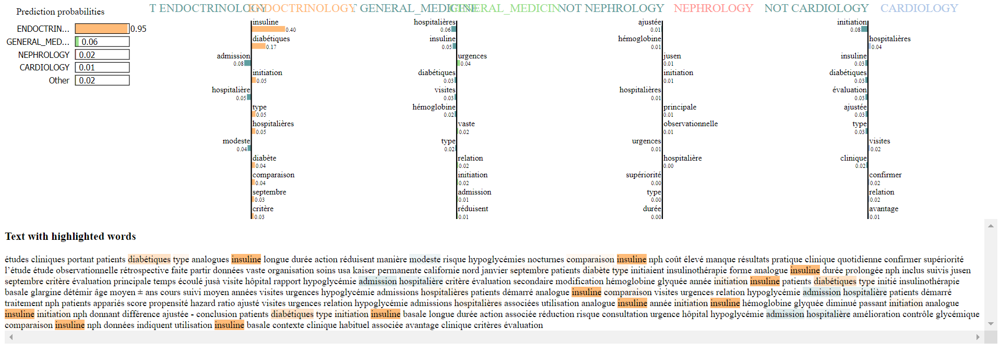

# French Medical Text Labeler

This repository contains a machine learning model trained on thousands of french medical articles to generate appropriate labels for given input texts.
The model was trained on around 40 000 scraped articles found on 4 different websites.

## Getting Started

Modify the sample_text.txt file with your own text.

Run the Text_labelling.ipynb notebook.

You should get the following output

### Installation

pip install -r requirements.txt

## Authors

* **Antoine Sueur**
